# Instalar odoo en instancia AWS EC2 con RDS PostgreSQL

    

        <strong>1.</strong>Crear base de datos <strong>RDS</strong> con <strong>PostgreSQL</strong>
    

    
Aplicar todos los cambios que se realizan en la imagen

    
    
Esperamos hasta que se encuentre <strong>Disponible</strong>

    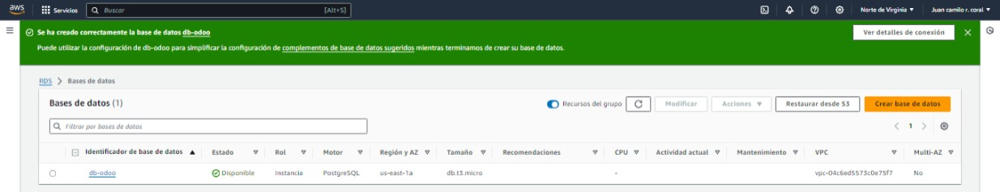

**[Volver ⤴️](#rds)**

    

        <strong>2.</strong> Modificar grupo de seguridad</strong>
    

    
Ingresamos a nuestro RDS y seleccionamos el grupo de seguridad <strong>default (...)</strong>

    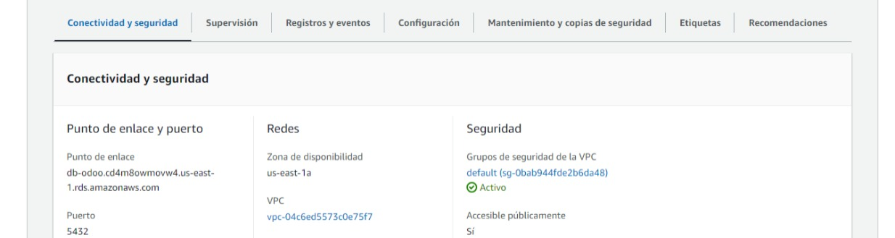
    
Ingresamos a <strong>ID de grupo de seguridad</strong>

    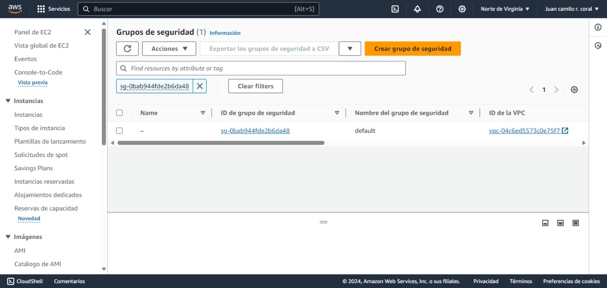
    
Editar reglas de entrada

    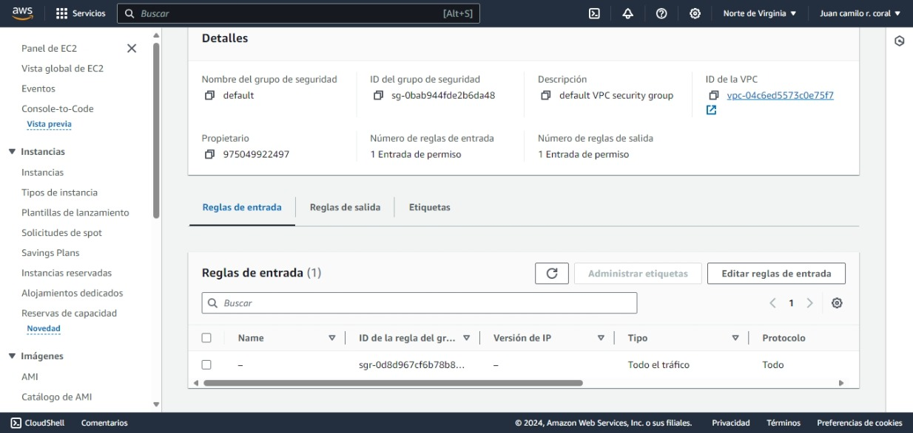
    
Creamos una regla de entrada para poder conectarse de forma remota

    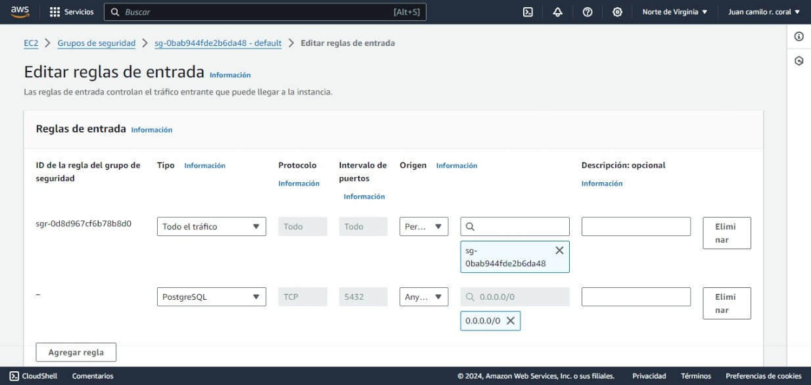

    

        <strong>3.</strong> Conexión remota a <strong>RDS</strong>
    

    <ul>
        <li>
            
Descargar <strong>DBeaver ➡️ <a src="https://dbeaver.io/download/">Aquí</a>
</strong>
        </li>
        <li>
            
Seleccionamos <strong>Base de datos ➡️ Nueva conexión</strong>

            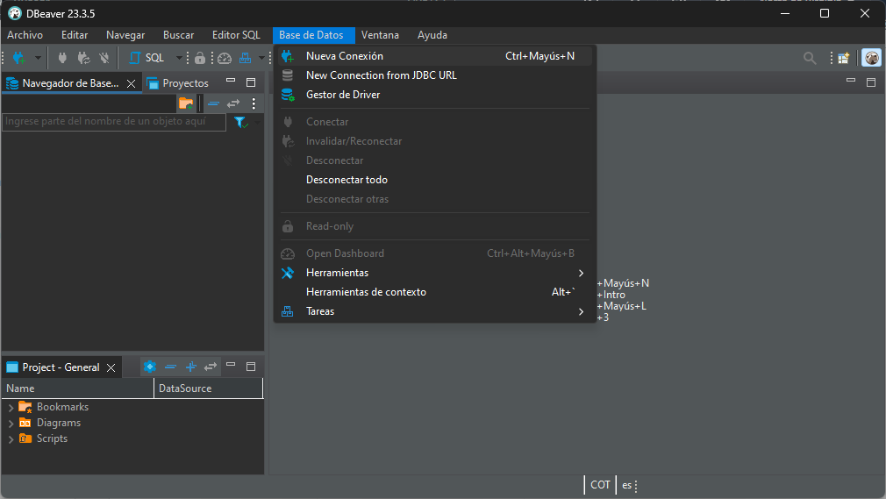
        </li>
        <li>
            
Seleccionamos el <strong>motor de base de datos</strong>, en este caso <strong>PostgreSQL</strong>.

            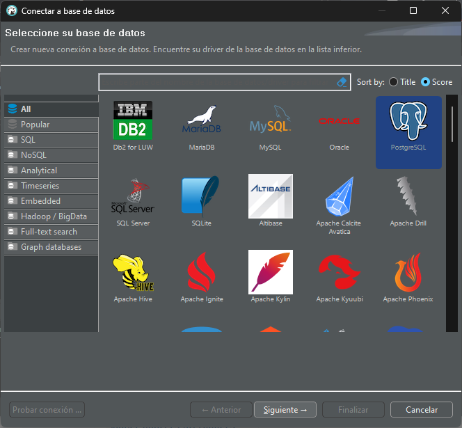
        </li>
        <li>
            
Registramos ➡️ <strong>Host (punto de enlace) ➡️ Database (registrada en rds) ➡️ Port (5432) ➡️ Nombre de usuario (registrado en rds) ➡️ Contraseña (registrada en rds)</strong>

            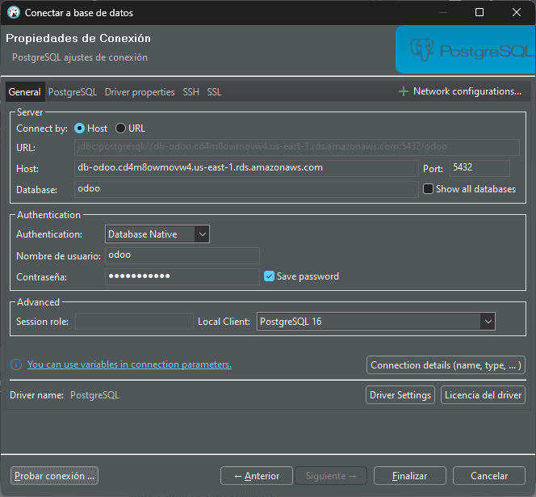
            Por último, <strong>Probar conexión</strong>
            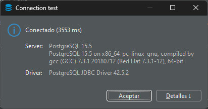
        </li>
        <li>
            
Si todo está bien configurado, debería salir así

            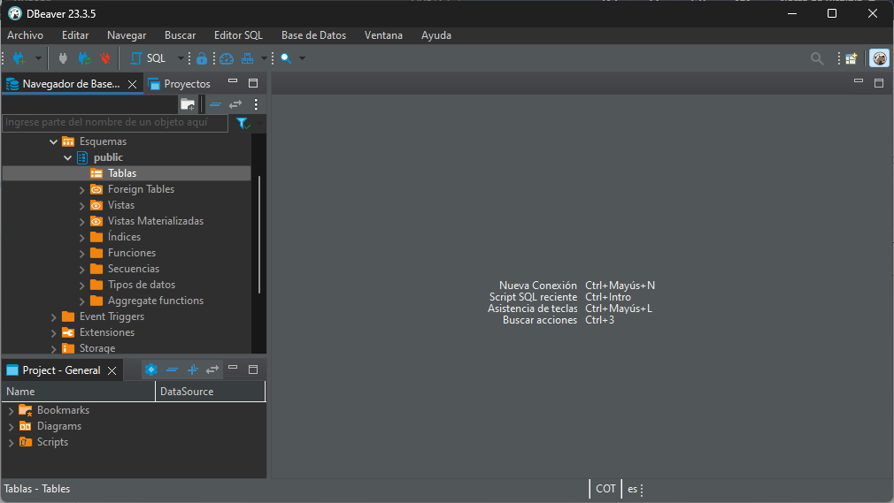
            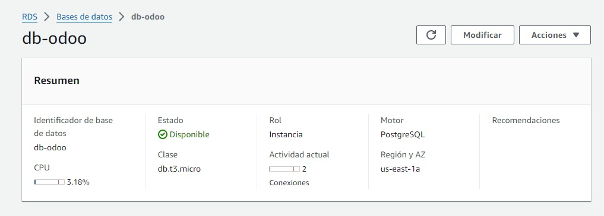
        </li>
    </ul>

    

        <strong>4.</strong> Instalar <strong>recursos necesarios para odoo</strong>
    

    <ul>
        <li>
            
Ingresamos como superusuario ➡️ <code>sudo su</code> y actualizamos repositorios ➡️ <code>apt update</code>

            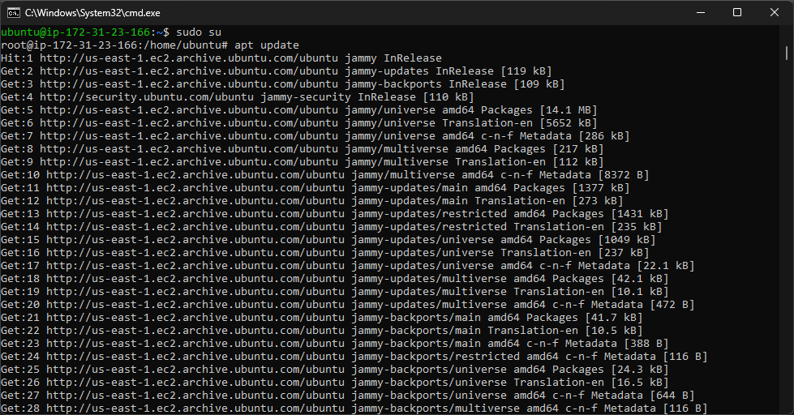
        </li>
        <li>
            
Instalamos el siguiente bloque de aplicaciones (dependencias) ➡️ <code>apt install python3-pip xfonts-75dpi xfonts-base libxrender1 libjpeg-turbo8 fontconfig -y</code>

            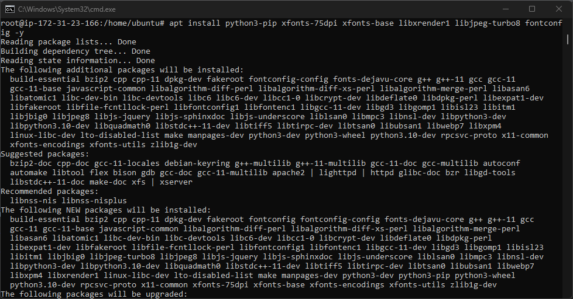
        </li>
        <li>
            
Instalamos la librería libssl1.1.
             ➡️ <code>echo "deb http://security.ubuntu.com/ubuntu focal-security main" | sudo tee /etc/apt/sources.list.d/focal-security.list</code>

            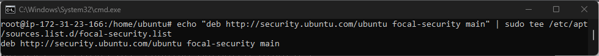
            

             Ahora sí, actualizamos nuestro sistema e instalamos la librería que necesitamos.
             ➡️ <code>apt update</code>
             ➡️ <code>apt install libssl1.1</code>

            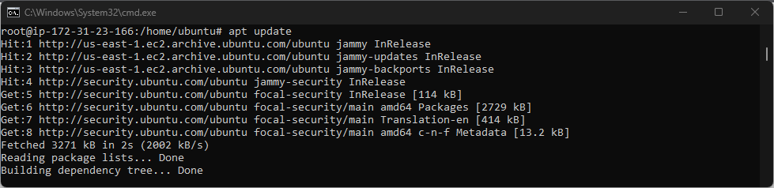
            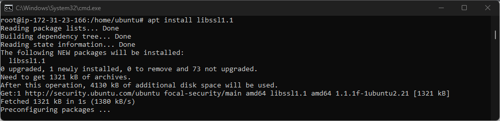
        </li>
        <li>
            
Entramos a al directorio ➡️ <code>cd /opt</code> y descargamos <strong>Wkhtmltopdf</strong> ➡️ <code>wget https://github.com/wkhtmltopdf/packaging/releases/download/0.12.6-1/wkhtmltox_0.12.6-1.bionic_amd64.deb</code>

            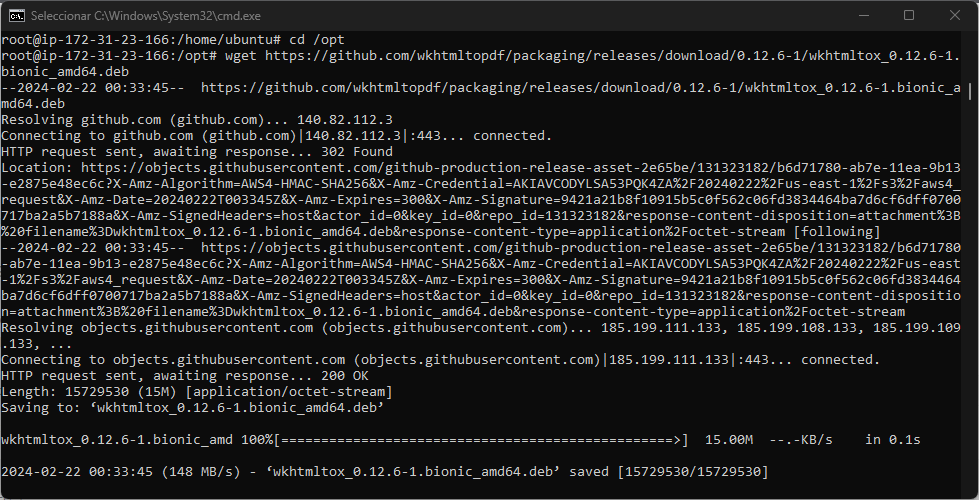
            
y procedemos a la instalación del paquete ➡️ <code>dpkg -i wkhtmltox_0.12.6-1.bionic_amd64.deb</code>

            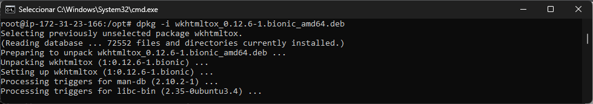
            
Luego, copiamos los siguientes binarios en ciertas rutas del sistema.
             ➡️ <code>cp /usr/local/bin/wkhtmltoimage  /usr/bin/wkhtmltoimage</code>
             ➡️ <code>cp /usr/local/bin/wkhtmltopdf  /usr/bin/wkhtmltopdf</code>

            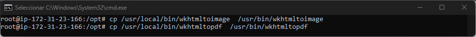
        </li>
    </ul>

    

        <strong>5.</strong> Instalación de <strong>Odoo 16</strong>
    

    <ul>
        <li>
            
Ya tenemos todo preparado para instalar odoo, ejecutamos los siguientes comandos
             ➡️ <code>wget -q -O - https://nightly.odoo.com/odoo.key | sudo gpg --dearmor -o /usr/share/keyrings/odoo-archive-keyring.gpg</code>
             ➡️ <code>echo 'deb [signed-by=/usr/share/keyrings/odoo-archive-keyring.gpg] https://nightly.odoo.com/16.0/nightly/deb/ ./' | sudo tee /etc/apt/sources.list.d/odoo.list</code>
             ➡️ <code>apt update</code>
            

            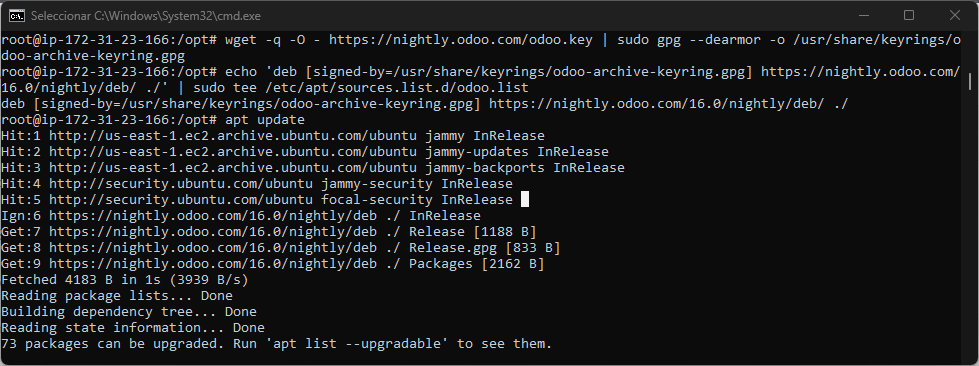
        </li>
        <li>
            
Por último, finalmente instalación ➡️ <code>apt install odoo -y</code>

            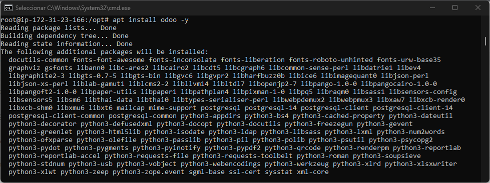
            
Se encargará de descargar e instalar todo lo necesario para <strong>Odoo</strong>, en el caso de hacer la instalación de manera local, dependerá de su computadora y la velocidad de su internet, en nuestro caso será rápido porque está directamente desde los servidores de <strong>AWS</strong>

        </li>
        <li>
            
Revisamos si está en ejecución <strong>odoo.service</strong> ➡️ <code>systemctl status odoo</code>

            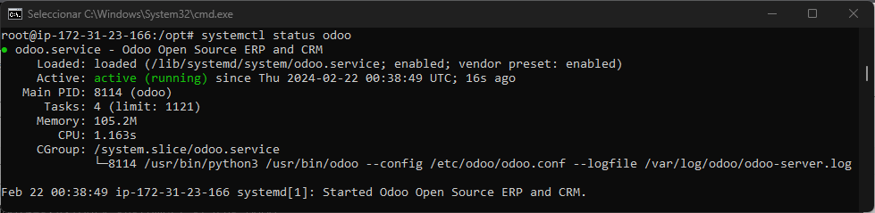
            
Veamos si se encuentra algún error en el log de odoo ➡️ <code>tail -n 20 /var/log/odoo/odoo-server.log</code>

            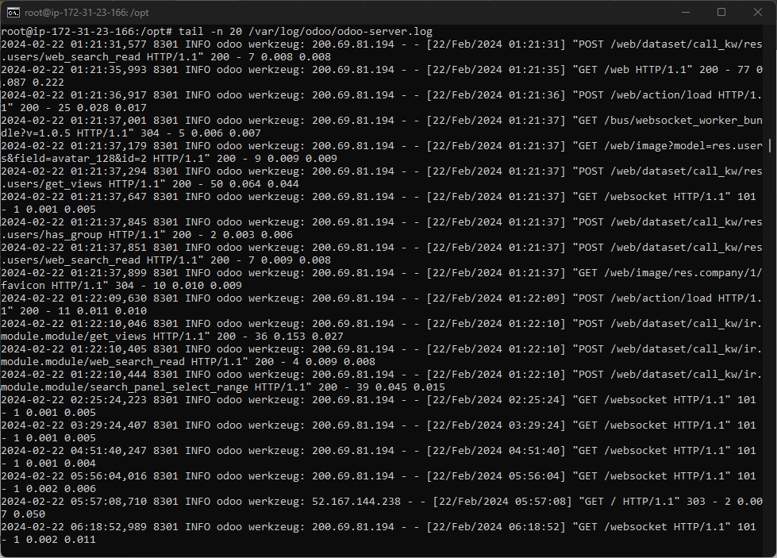
            
Visualizamos las primeras 20 líneas.
        </li>
    </ul>

        

            <strong>6.</strong> Configuración final de <strong>Odoo 16</strong>
        

    <ul>
        <li>
            
Entramos a la siguiente ruta y editamos el archivo odoo.conf ➡️ <code>cd /etc/odoo/odoo.conf</code>
             db_host ➡️ punto de enlace RDS
             db_port ➡️ puerto de RDS postgres
             db_user ➡️ usuario de RDS
             db_password ➡️ contraseña de RDS
            

            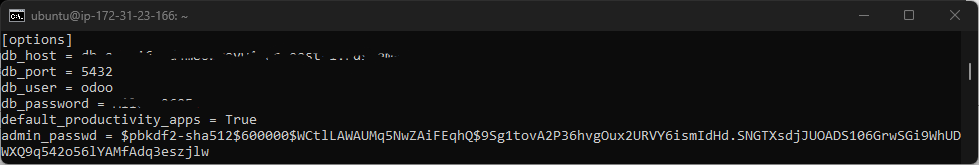
        </li>
        <li>
            
Entramos a nuestra página y configuramos como está en la imagen y por último en create database ➡️ <code>IP-publica:8069</code>

            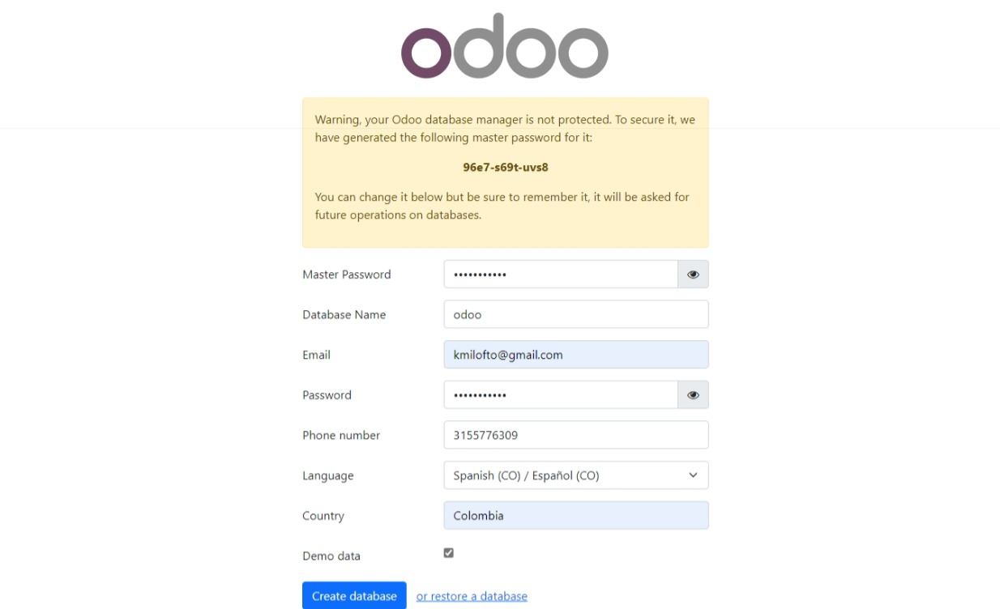
            
Recuerda que debes abrir el puerto 8069 en el grupo de seguridad de la instancia EC2 para que odoo tenga vía libre

        </li>
        <li>
            
Iniciamos sesión con el correo y contraseña previamente creados ➡️ <code>IP-publica:8069</code>

            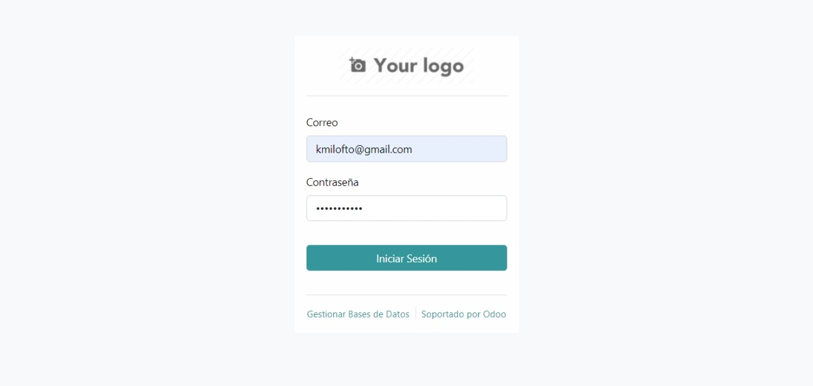
        </li>
        <li>
            
Y listo, ya podemos explorar odoo a nuestro antojo ➡️ <code>IP-publica:8069</code>

            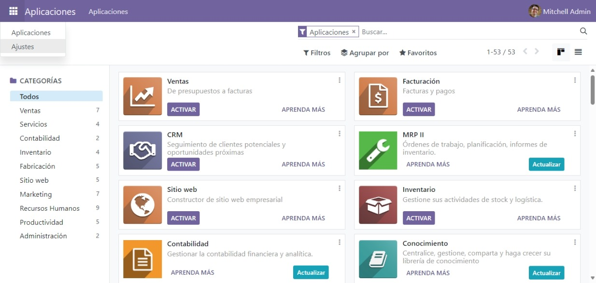
        </li>
    </ul>

